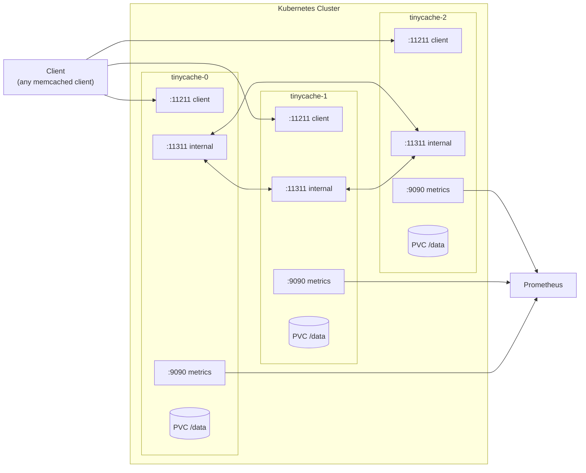
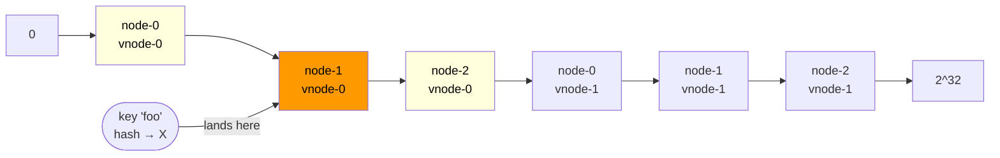
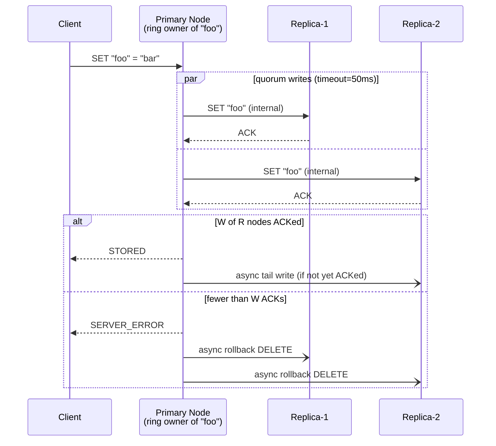
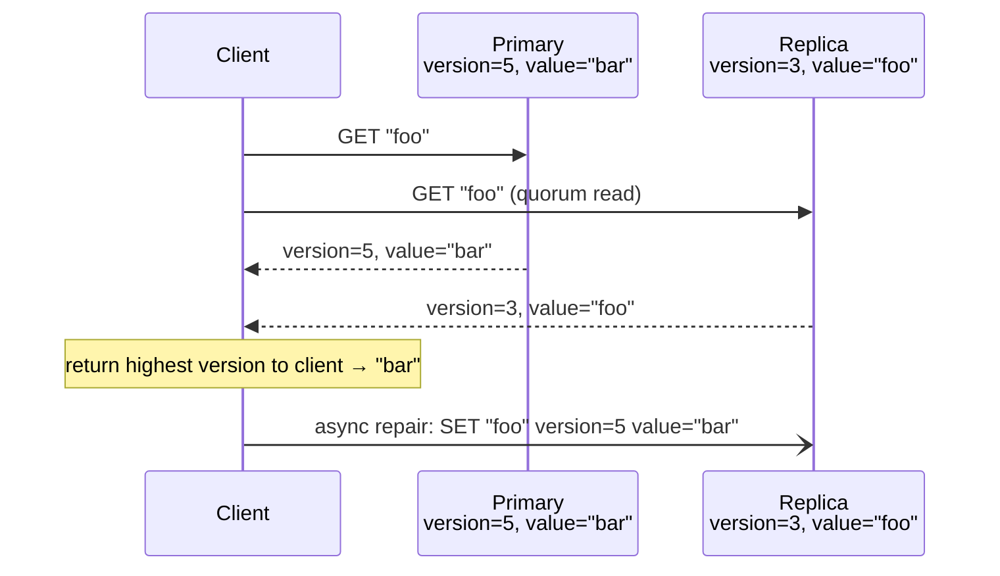
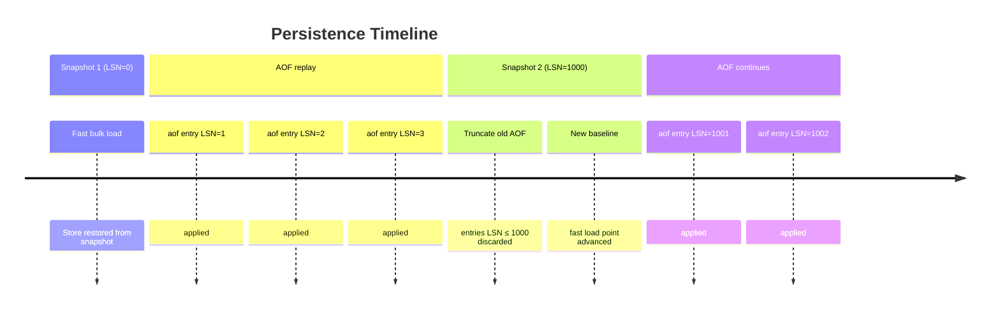
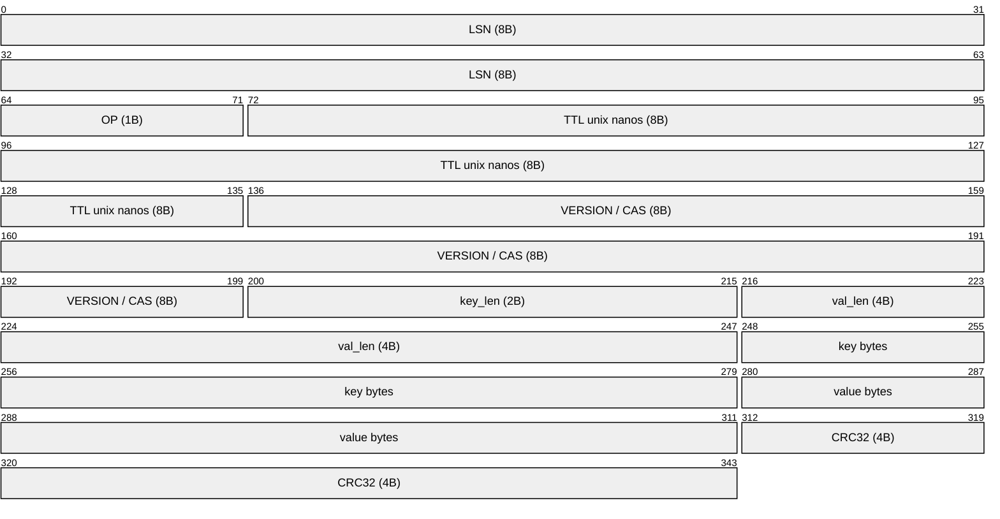
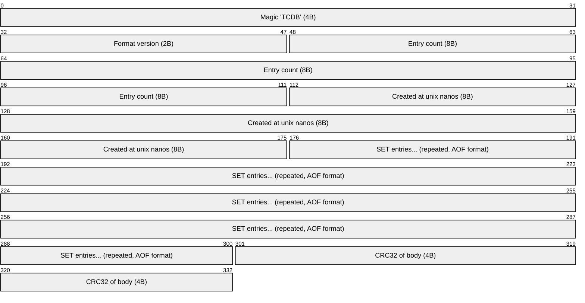
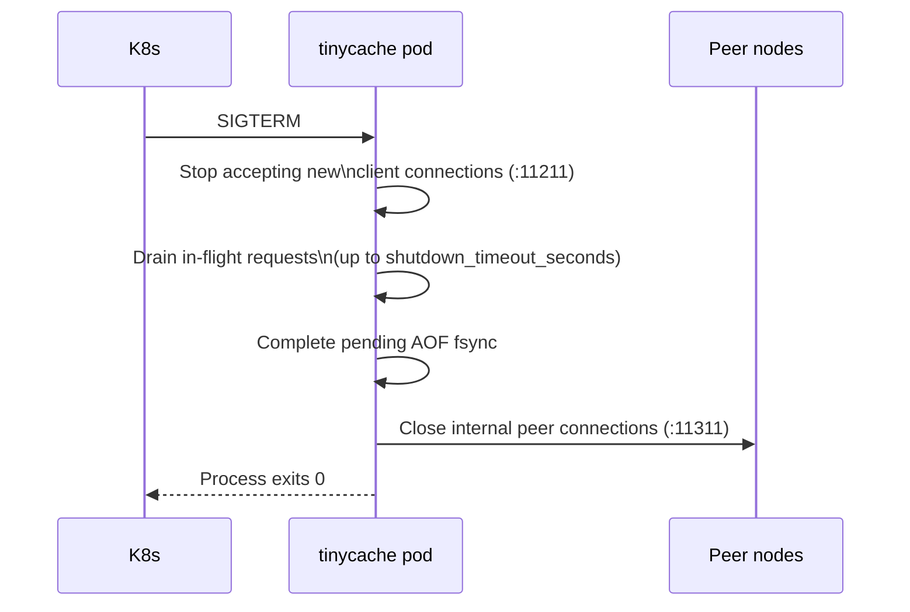

# tinycache

A distributed, cluster-native in-memory cache implementing the **Memcached text protocol**, designed from the ground up for deployment on **Kubernetes**.

> tinycache is not a general-purpose database. It is a cache — data stored here is considered **reproducible**. Persistence exists to speed up recovery, not to guarantee zero data loss.

---

## Table of Contents

- [Guiding Principles](#guiding-principles)
- [Architecture Overview](#architecture-overview)
- [Cluster Topology](#cluster-topology)
- [Consistency Model](#consistency-model)
- [Persistence](#persistence)
- [Kubernetes Deployment](#kubernetes-deployment)
- [Configuration Reference](#configuration-reference)
- [Memcached Protocol Support](#memcached-protocol-support)
- [Internal Peer Protocol](#internal-peer-protocol)
- [Metrics & Observability](#metrics--observability)
- [Failure Modes](#failure-modes)
- [Project Structure](#project-structure)
- [Building & Running Locally](#building--running-locally)

---

## Guiding Principles

**1. Cluster-first, single-node never.**
tinycache has no standalone mode. Every node is aware of the ring. This is a deliberate constraint — it eliminates an entire class of misconfigurations where a "cluster" is accidentally a set of independent caches.

**2. Explicit failures over silent data loss.**
If a write cannot meet quorum, the client receives `SERVER_ERROR`. tinycache will never acknowledge a write that has not been applied to the required number of nodes. Partial writes are rolled back asynchronously.

**3. Kubernetes is the deployment primitive, not an afterthought.**
Node identity, peer discovery, storage, and graceful shutdown are all designed around StatefulSet semantics. There is no "bare metal mode" to maintain.

**4. The Memcached protocol is the API contract.**
Any existing Memcached client works with tinycache without modification. The internal cluster machinery — routing, replication, quorum, repair — is entirely transparent to the client.

**5. Operational simplicity over feature completeness.**
tinycache does not implement Lua scripting, pub/sub, streams, or modules. It does one thing: store key-value pairs in a cluster with tunable consistency and light persistence.

**6. Memory is the primary resource.**
Disk persistence is a recovery aid, not a storage backend. The working set must always fit in memory. When memory pressure is reached, LRU eviction runs — the node will never OOMKill itself trying to honor a write.

---

## Architecture Overview



**Ports per node:**

| Port    | Purpose                                         |
| ------- | ----------------------------------------------- |
| `11211` | Memcached client-facing TCP                     |
| `11311` | Internal peer-to-peer TCP (proxy + replication) |
| `9090`  | Prometheus metrics + health HTTP endpoints      |

---

## Cluster Topology

### StatefulSet + Headless Service

tinycache uses Kubernetes StatefulSet to achieve **stable, predictable pod identities**. Each pod gets a DNS name of the form:

```
tinycache-{ordinal}.tinycache.{namespace}.svc.cluster.local
```

Node identity is derived entirely from the `POD_NAME` environment variable (injected by K8s via `fieldRef`). There is no manual peer list. The ring is constructed deterministically from:

- `cluster.replicas` — total number of pods (must match `StatefulSet.spec.replicas`)
- `cluster.service_name` — headless service name
- `cluster.namespace` — from `POD_NAMESPACE` env var

On startup, each node resolves all peer DNS names and blocks readiness until all peers are reachable.

### Consistent Hash Ring

Keys are distributed across nodes using a **consistent hash ring** with virtual nodes (vnodes):

- Each physical node is mapped to `N` vnodes (default: 150) on the ring
- Ring is a sorted array of `uint32` vnode hashes, each mapping back to a physical node
- Key placement: `xxhash(key) mod 2^32` → walk ring clockwise to find primary node
- Adding/removing a node rebalances only `1/N` of keys on average

**Replica placement:** the `R` replicas for a key are the next `R-1` distinct physical nodes clockwise from the primary on the ring. Virtual nodes of the same physical node are skipped.



`key "foo"` hashes to `X`, lands in `node-1-v0`'s range → **primary: node-1**, replicas (R=3): node-2, node-0.

### Request Routing

A client may connect to **any** node. The receiving node checks ring ownership:

- **Local key** → serve from local store directly
- **Remote key** → proxy the raw command over the internal TCP connection to the primary node, forward response back to client

Proxy connections to peers are maintained as a persistent pool per peer node. If the target node is unreachable, `SERVER_ERROR` is returned immediately — there is no client-transparent retry that could mask a cluster health issue.

---

## Consistency Model

tinycache implements **eventual consistency with quorum-based writes** — often called "not-really-strong" consistency. It provides stronger guarantees than pure eventual consistency while avoiding the complexity and latency cost of full linearizability.

### Write Path — Quorum Writes



- **R** (replication factor): total replicas per key, default `3`
- **W** (write quorum): minimum ACKs required, default `2` (`floor(R/2) + 1`)
- Writes to nodes beyond quorum proceed asynchronously in the background
- Partial writes (fewer than W ACKs) trigger async `DELETE` to nodes that did ACK, preventing stale reads

### Read Path — Tunable Read Quorum

| `read_quorum` | Behavior                                     | Guarantee                                                 |
| ------------- | -------------------------------------------- | --------------------------------------------------------- |
| `1` (default) | Read from primary only                       | Fast; may return a value not yet fully replicated         |
| `2` (quorum)  | Read from `RQ` nodes, return highest version | Sees any write completed at `W=2`; satisfies `W + RQ > R` |

With `read_quorum=2` and `write_quorum=2` on a ring of 3 replicas: `2 + 2 > 3` ✓ — the read and write sets are guaranteed to overlap by at least one node.

### CAS — Per-Key Optimistic Locking

- Every cache entry carries a `uint64` version counter (the CAS token)
- `gets` always fetches the token from the **primary** node, even if the client connected to a replica
- `cas` is always executed on the primary, which atomically checks-and-increments the version, then replicates
- This makes CAS **linearizable per key** at the primary level — no split-brain on tokens

### Read Repair

When a quorum read detects a version mismatch across replicas:



Read repair is **asynchronous** — the client receives the correct (highest version) value immediately. The repair happens in the background. This is the primary anti-entropy mechanism; there is no background key scanner.

---

## Persistence

Persistence in tinycache serves **recovery speed**, not durability guarantees. The source of truth for a key is the cluster — a single node's disk is just a warm-start cache.

### Two Mechanisms

**AOF (Append-Only File)** — written after every mutating command that achieved quorum. Provides fine-grained durability. Every entry is CRC32-checksummed to detect torn writes on crash.

**Snapshot (RDB-style)** — periodic full binary dump of the in-memory store. Provides fast baseline for recovery. On restart, the snapshot is loaded first, then only the AOF tail (entries with LSN > last snapshot LSN) is replayed.



### AOF Entry Format

Binary framing with fixed header, variable-length key/value, and trailing checksum:



`OP` codes: `0x01 = SET` | `0x02 = DELETE` | `0x03 = FLUSH_ALL`

### Snapshot Format



Snapshots are written atomically: `snapshot.rdb.tmp` → `fsync` → `rename` to `snapshot.rdb`. A crash mid-write leaves the previous snapshot intact.

### Recovery Sequence


### fsync Modes

| Mode       | Behavior                      | Max data loss on crash |
| ---------- | ----------------------------- | ---------------------- |
| `always`   | fsync after every AOF write   | 0 entries              |
| `everysec` | background fsync every second | ~1 second of writes    |
| `no`       | OS-managed flushing           | undefined              |

`everysec` is the recommended default for cache workloads.

### Storage in Kubernetes

Each StatefulSet pod gets a dedicated PersistentVolumeClaim via `volumeClaimTemplates`:

```
/data/
├── snapshot.rdb        # latest valid snapshot
├── snapshot.rdb.tmp    # in-progress snapshot (safe to delete on startup)
└── aof.log             # append-only log
```

---

## Kubernetes Deployment

### Resource Model

```
deploy/
├── statefulset.yaml          # 3-replica StatefulSet with PVC template
├── headless-service.yaml     # DNS-based peer discovery (clusterIP: None)
├── client-service.yaml       # ClusterIP service for client traffic on :11211
├── configmap.yaml            # tinycache config.yaml
└── poddisruptionbudget.yaml  # maxUnavailable: 1
```

### StatefulSet Design Decisions

**Readiness gate:** a pod does not join the ring and does not become ready until it has successfully resolved all peer DNS names and established connections on the internal port. This prevents a partially-started node from receiving traffic it cannot correctly route.

**Liveness vs Readiness:**
- `GET /healthz` (liveness) — process is alive and not deadlocked
- `GET /readyz` (readiness) — ring initialized, peers reachable, recovery complete

Both are served on the metrics port (`:9090`) to avoid opening an extra listener.



Rolling updates proceed one pod at a time. With `replication_factor=3` and `write_quorum=2`, the cluster remains fully operational during a single-pod rolling update.

**PodDisruptionBudget:** `maxUnavailable: 1` ensures K8s never voluntarily takes down more than one pod simultaneously (e.g. during node drain), preserving quorum.

**Memory limits:** `cache.max_memory_mb` must be set to a value below the container's memory `limit`. When the threshold is reached, LRU eviction runs before accepting new writes. This prevents OOMKill from losing un-fsynced AOF entries.

---

## Configuration Reference

```yaml
node:
  addr: "0.0.0.0:11211"           # client-facing TCP
  internal_addr: "0.0.0.0:11311"  # peer-to-peer TCP

cluster:
  replicas: 3                      # must match StatefulSet replicas
  service_name: "tinycache"        # K8s headless service name
  namespace: "default"             # from POD_NAMESPACE env var
  replication_factor: 3            # R: total replicas per key
  write_quorum: 2                  # W: min ACKs to confirm write
  read_quorum: 1                   # RQ: 1=fast, 2=consistent
  quorum_timeout_ms: 50            # max wait for replica ACKs
  virtual_nodes: 150               # vnodes per physical node on ring
  repair_enabled: true             # async read-repair on version mismatch

cache:
  max_memory_mb: 256               # triggers LRU eviction when reached
  default_ttl_seconds: 0           # 0 = no expiry
  eviction_interval_ms: 500        # TTL expiry scan interval

persistence:
  enabled: true
  data_dir: "/data"
  aof:
    enabled: true
    fsync: "everysec"              # "always" | "everysec" | "no"
    max_size_mb: 512               # triggers compaction when exceeded
  snapshot:
    enabled: true
    interval_seconds: 300          # snapshot every 5 minutes
    min_changes: 1000              # or after 1000 mutations

metrics:
  enabled: true
  addr: "0.0.0.0:9090"            # also serves /healthz and /readyz

server:
  shutdown_timeout_seconds: 30
  max_connections: 10000
  read_timeout_ms: 5000
  write_timeout_ms: 5000
```

**Environment variables** (injected by K8s, override config):

| Variable           | Source                         | Used for                |
| ------------------ | ------------------------------ | ----------------------- |
| `POD_NAME`         | `fieldRef: metadata.name`      | Node ordinal + identity |
| `POD_NAMESPACE`    | `fieldRef: metadata.namespace` | DNS peer resolution     |
| `TINYCACHE_CONFIG` | manual / ConfigMap mount       | Config file path        |

---

## Memcached Protocol Support

tinycache implements the **Memcached text protocol**. Any standard Memcached client is compatible without modification.

### Supported Commands

| Command                                           | Description                        |
| ------------------------------------------------- | ---------------------------------- |
| `get <key> [<key>...]`                            | Retrieve one or more values        |
| `gets <key> [<key>...]`                           | Retrieve with CAS token            |
| `set <key> <flags> <exptime> <bytes>`             | Store unconditionally              |
| `add <key> <flags> <exptime> <bytes>`             | Store only if key does not exist   |
| `replace <key> <flags> <exptime> <bytes>`         | Store only if key exists           |
| `delete <key>`                                    | Remove a key                       |
| `cas <key> <flags> <exptime> <bytes> <cas_token>` | Store if CAS token matches         |
| `flush_all [<delay>]`                             | Invalidate all keys (cluster-wide) |
| `stats`                                           | Node statistics                    |
| `quit`                                            | Close connection                   |

### Not Implemented

- Binary protocol
- `incr` / `decr`
- `append` / `prepend`
- `touch`
- SASL authentication

These may be added in future versions. The binary protocol is the most likely next addition.

---

## Internal Peer Protocol

Peer-to-peer communication (proxy forwarding and replication) uses a **thin binary framing layer** over TCP on the internal port (`:11311`). This is distinct from the client-facing Memcached text protocol.

The framing carries:
- The original command payload (forwarded verbatim for proxying)
- Version metadata (for replication and read-repair comparison)
- LSN (for AOF coordination)

This separation means the internal protocol can evolve independently of the client-facing protocol, and version/LSN fields do not pollute the Memcached wire format.

---

## Metrics & Observability

All metrics are exposed in Prometheus format at `http://<node>:9090/metrics`.

### Counters

| Metric                               | Labels                   | Description                           |
| ------------------------------------ | ------------------------ | ------------------------------------- |
| `tinycache_hits_total`               | —                        | Successful GET hits                   |
| `tinycache_misses_total`             | —                        | GET misses (key not found or expired) |
| `tinycache_commands_total`           | `command`                | Total commands by type                |
| `tinycache_proxy_requests_total`     | `target_node`            | Requests proxied to peer              |
| `tinycache_replication_writes_total` | `target_node`, `status`  | Replication attempts                  |
| `tinycache_evictions_total`          | `reason` (`ttl`, `lru`)  | Keys evicted                          |
| `tinycache_aof_writes_total`         | —                        | AOF entries written                   |
| `tinycache_snapshots_total`          | `status` (`ok`, `error`) | Snapshot completions                  |

### Gauges

| Metric                         | Labels | Description                     |
| ------------------------------ | ------ | ------------------------------- |
| `tinycache_keys_total`         | —      | Current number of keys in store |
| `tinycache_memory_bytes`       | —      | Estimated memory used by store  |
| `tinycache_connections_active` | —      | Active client connections       |
| `tinycache_ring_nodes`         | —      | Number of nodes on the ring     |

### Histograms

| Metric                               | Labels                 | Description                   |
| ------------------------------------ | ---------------------- | ----------------------------- |
| `tinycache_command_duration_seconds` | `command`              | Command latency               |
| `tinycache_quorum_duration_seconds`  | `op` (`write`, `read`) | Time to achieve quorum        |
| `tinycache_proxy_duration_seconds`   | `target_node`          | Peer proxy round-trip latency |

### Health Endpoints

| Endpoint       | Use                                                                        |
| -------------- | -------------------------------------------------------------------------- |
| `GET /healthz` | Liveness: returns `200 OK` if process is alive                             |
| `GET /readyz`  | Readiness: returns `200 OK` if ring is initialized and peers are reachable |
| `GET /metrics` | Prometheus metrics scrape                                                  |

---

## Failure Modes

| Scenario                                        | Behavior                                                                                       |
| ----------------------------------------------- | ---------------------------------------------------------------------------------------------- |
| Primary node for a key is unreachable           | Request is routed to the highest-version replica; async recovery on primary restart            |
| Write achieves fewer than W ACKs within timeout | `SERVER_ERROR` returned to client; async rollback (DELETE) sent to nodes that ACKed            |
| Replica is down during a write                  | Write succeeds if W is still met; async retry to the replica once it recovers                  |
| Pod restarts (crash or rolling update)          | Node recovers from snapshot + AOF, rejoins ring, read-repair syncs missed writes               |
| Network partition isolating a minority          | Minority nodes cannot achieve write quorum; they return `SERVER_ERROR` — no split-brain writes |
| AOF file corrupt (CRC mismatch)                 | Replay stops at last valid entry; node logs a warning and starts with partial state            |
| Snapshot file corrupt                           | Snapshot is discarded; full AOF replay from beginning is attempted                             |
| Memory limit reached                            | LRU eviction runs; if store cannot shrink enough, new writes return `SERVER_ERROR`             |

---

## Project Structure

```
tinycache/
├── cmd/
│   └── tinycache/
│       └── main.go                  # Wiring, signal handling, graceful shutdown
├── internal/
│   ├── cache/
│   │   ├── store.go                 # Sharded in-memory store, CAS, TTL
│   │   ├── store_test.go
│   │   └── eviction.go              # Background TTL + LRU eviction loop
│   ├── cluster/
│   │   ├── ring.go                  # Consistent hash ring, vnode placement
│   │   ├── ring_test.go
│   │   ├── node.go                  # Identity from POD_NAME, DNS peer resolution
│   │   └── router.go                # Route key → local/proxy, peer conn pool
│   ├── protocol/
│   │   ├── parser.go                # Memcached text protocol parser
│   │   ├── parser_test.go
│   │   └── response.go              # Response builders (STORED, VALUE, ERROR, ...)
│   ├── server/
│   │   ├── tcp.go                   # TCP listener, connection lifecycle
│   │   └── handler.go               # Command dispatch, quorum coordination
│   ├── replication/
│   │   └── replicator.go            # Quorum writes, async tail writes, read-repair
│   ├── persistence/
│   │   ├── aof.go                   # AOF writer, fsync modes, LSN tracking
│   │   ├── aof_reader.go            # AOF replay
│   │   ├── snapshot.go              # Snapshot writer (background goroutine)
│   │   ├── snapshot_reader.go       # Snapshot loader
│   │   ├── lsn.go                   # Atomic LSN counter
│   │   └── recovery.go              # Startup: load snapshot → replay AOF
│   └── metrics/
│       └── prometheus.go            # Collectors, /metrics, /healthz, /readyz
├── config/
│   └── config.go                    # Config struct, YAML + env parsing
├── deploy/
│   ├── statefulset.yaml
│   ├── headless-service.yaml
│   ├── client-service.yaml
│   ├── configmap.yaml
│   └── poddisruptionbudget.yaml
├── config.example.yaml
├── Makefile
├── Dockerfile
└── go.mod
```

---

## Building & Running Locally

### Prerequisites

- Go 1.22+
- Docker (for containerized local cluster)

### Build

```bash
make build        # builds ./bin/tinycache
make test         # runs all tests
make lint         # golangci-lint
make docker       # builds container image
```

### Local 3-Node Cluster (Docker Compose)

```bash
make dev-cluster  # spins up 3 nodes + Prometheus
```

Nodes listen on `:11211`, `:11212`, `:11213`. Connect with any Memcached client:

```bash
# using memcached CLI
echo "set foo 0 0 3\r\nbar\r\n" | nc localhost 11211

# using Python
python3 -c "
import pymemcache.client.base as mc
c = mc.Client(('localhost', 11211))
c.set('foo', 'bar')
print(c.get('foo'))
"
```

### Running a Single Node (for development)

```bash
POD_NAME=tinycache-0 \
POD_NAMESPACE=default \
TINYCACHE_CONFIG=./config.example.yaml \
./bin/tinycache
```

---

## Dependencies

| Package                               | Purpose                                           |
| ------------------------------------- | ------------------------------------------------- |
| `github.com/cespare/xxhash/v2`        | Fast non-cryptographic hashing for ring placement |
| `github.com/prometheus/client_golang` | Prometheus metrics instrumentation                |
| `gopkg.in/yaml.v3`                    | Configuration file parsing                        |

No external cluster libraries. No service mesh dependency. No sidecar required.

---

## License

MIT