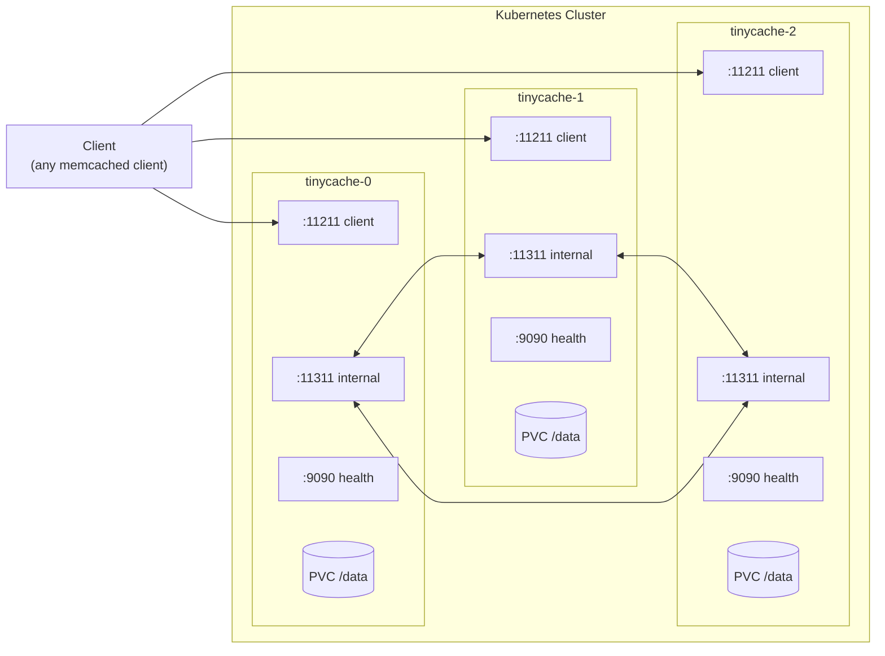
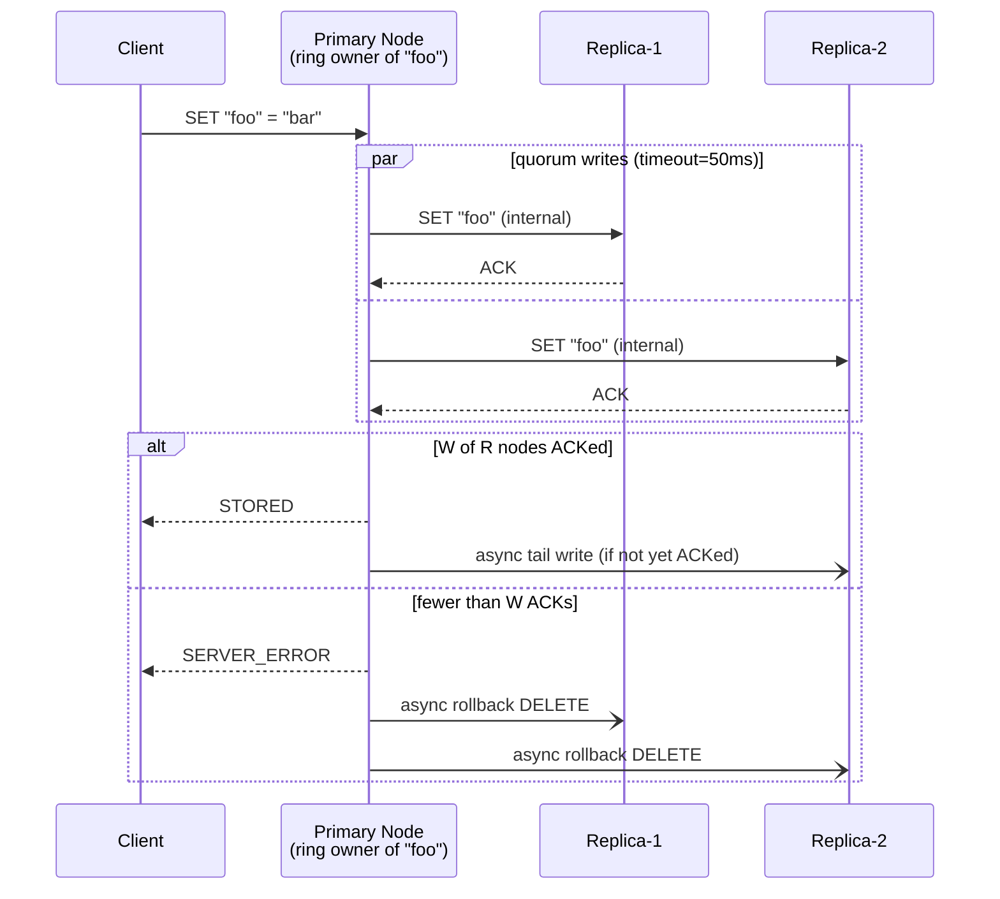
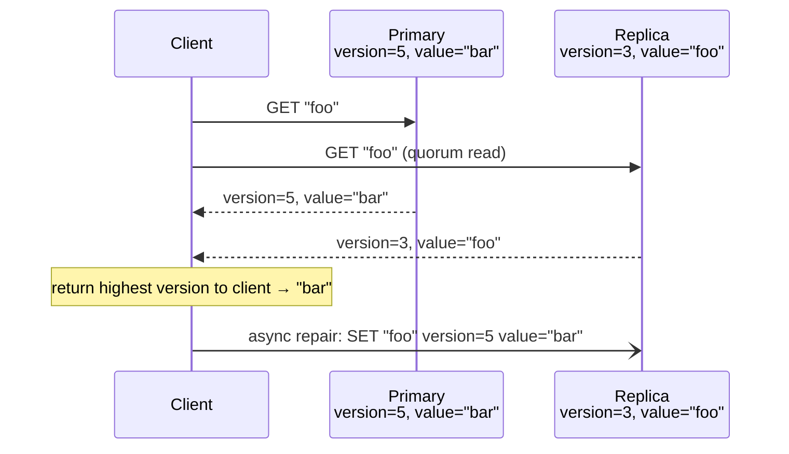
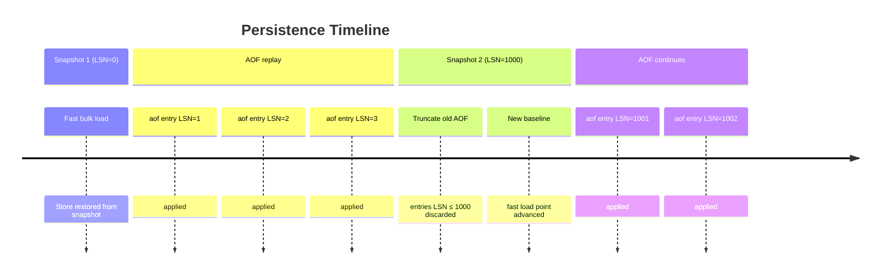
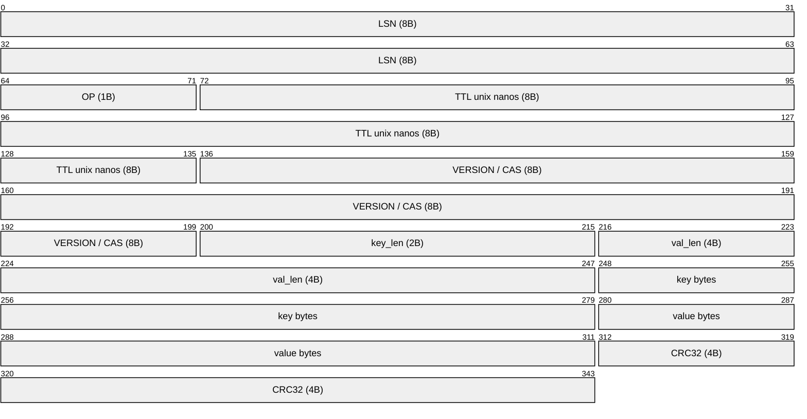
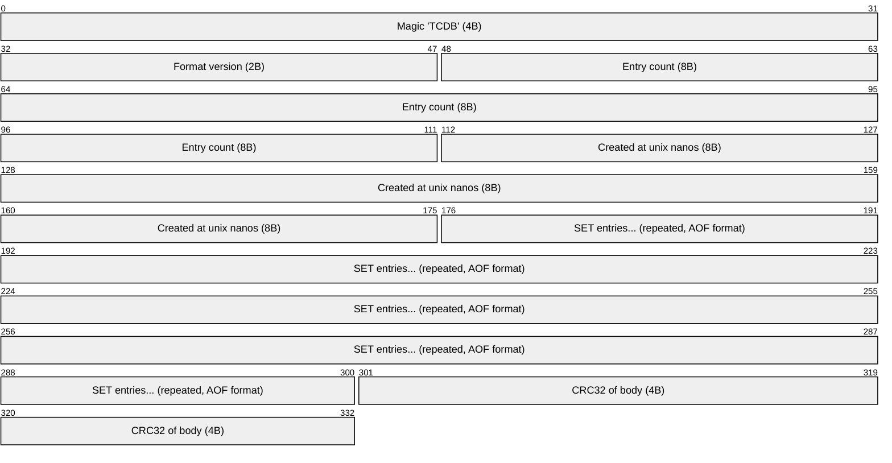
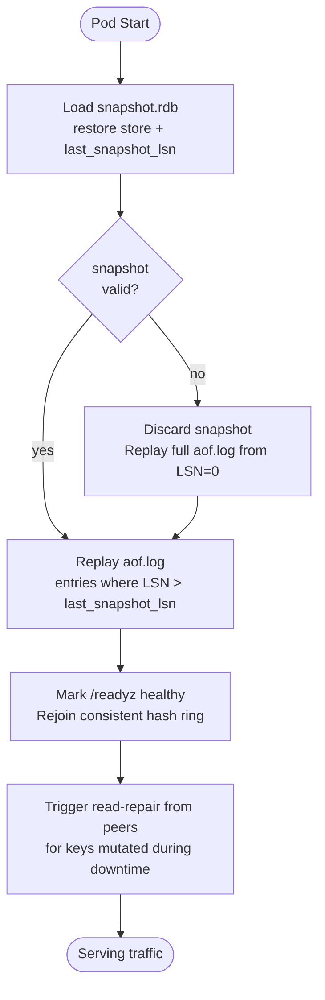
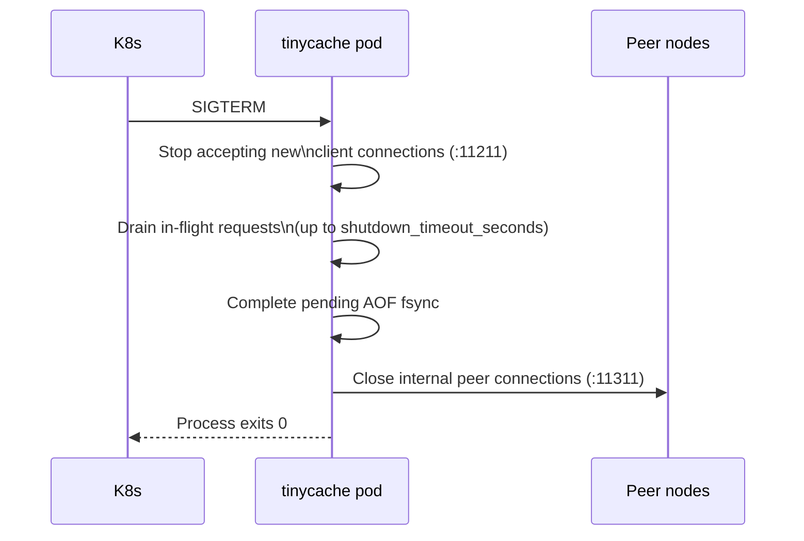

# tinycache

A distributed, cluster-native in-memory cache implementing the **Memcached text protocol**, designed from the ground up for deployment on **Kubernetes**.

> tinycache is not a general-purpose database. It is a cache — data stored here is considered **reproducible**. Persistence exists to speed up recovery, not to guarantee zero data loss.

---

## Table of Contents

- [Guiding Principles](#guiding-principles)
- [Architecture Overview](#architecture-overview)
- [Cluster Topology](#cluster-topology)
- [Consistency Model](#consistency-model)
- [Persistence](#persistence)
- [Kubernetes Deployment](#kubernetes-deployment)
- [Configuration Reference](#configuration-reference)
- [Memcached Protocol Support](#memcached-protocol-support)
- [Internal Peer Protocol](#internal-peer-protocol)
- [Observability](#observability)
- [Failure Modes](#failure-modes)
- [Project Structure](#project-structure)
- [Building & Running Locally](#building--running-locally)

---

## Guiding Principles

**1. Cluster-first, single-node never.**
tinycache has no standalone mode. Every node is aware of the ring. This is a deliberate constraint — it eliminates an entire class of misconfigurations where a "cluster" is accidentally a set of independent caches.

**2. Explicit failures over silent data loss.**
If a write cannot meet quorum, the client receives `SERVER_ERROR`. tinycache will never acknowledge a write that has not been applied to the required number of nodes. Partial writes are rolled back asynchronously.

**3. Kubernetes is the deployment primitive, not an afterthought.**
Node identity, peer discovery, storage, and graceful shutdown are all designed around StatefulSet semantics. There is no "bare metal mode" to maintain.

**4. The Memcached protocol is the API contract.**
Any existing Memcached client works with tinycache without modification. The internal cluster machinery — routing, replication, quorum, repair — is entirely transparent to the client.

**5. Operational simplicity over feature completeness.**
tinycache does not implement Lua scripting, pub/sub, streams, or modules. It does one thing: store key-value pairs in a cluster with tunable consistency and light persistence.

**6. Memory is the primary resource.**
Disk persistence is a recovery aid, not a storage backend. The working set must always fit in memory. When memory pressure is reached, LRU eviction runs — the node will never OOMKill itself trying to honor a write.

---

## Architecture Overview



**Ports per node:**

| Port    | Purpose                                         |
| ------- | ----------------------------------------------- |
| `11211` | Memcached client-facing TCP                     |
| `11311` | Internal peer-to-peer TCP (proxy + replication) |
| `9090`  | Health HTTP endpoints (`/healthz`, `/readyz`)   |

---

## Cluster Topology

### StatefulSet + Headless Service

tinycache uses Kubernetes StatefulSet to achieve **stable, predictable pod identities**. Each pod gets a DNS name of the form:

```
tinycache-{ordinal}.tinycache.{namespace}.svc.cluster.local
```

Node identity is derived entirely from the `POD_NAME` environment variable (injected by K8s via `fieldRef`). There is no manual peer list. The ring is constructed deterministically from:

- `TC_CLUSTER_REPLICAS` — total number of pods (must match `StatefulSet.spec.replicas`)
- `TC_SERVICE_NAME` — headless service name
- `POD_NAMESPACE` — from K8s `fieldRef: metadata.namespace`

On startup, each node resolves all peer DNS names and blocks readiness until all peers are reachable.

### Consistent Hash Ring

Keys are distributed across nodes using a **consistent hash ring** with virtual nodes (vnodes):

- Each physical node is mapped to `N` vnodes (default: 150) on the ring
- Ring is a sorted array of `uint32` vnode hashes, each mapping back to a physical node
- Key placement: `fnv-1a(key) mod 2^32` → walk ring clockwise to find primary node
- Adding/removing a node rebalances only `1/N` of keys on average

**Replica placement:** the `R` replicas for a key are the next `R-1` distinct physical nodes clockwise from the primary on the ring. Virtual nodes of the same physical node are skipped.


`key "foo"` hashes to `X`, lands in `node-1-v0`'s range → **primary: node-1**, replicas (R=3): node-2, node-0.

### Request Routing

A client may connect to **any** node. The receiving node checks ring ownership:

- **Local key** → serve from local store directly
- **Remote key** → proxy the raw command over the internal TCP connection to the primary node, forward response back to client

Each proxy request opens a fresh TCP connection to the peer. If the target node is unreachable, `SERVER_ERROR` is returned immediately — there is no client-transparent retry that could mask a cluster health issue.

---

## Consistency Model

tinycache implements **eventual consistency with quorum-based writes** — often called "not-really-strong" consistency. It provides stronger guarantees than pure eventual consistency while avoiding the complexity and latency cost of full linearizability.

### Write Path — Quorum Writes



- **R** (replication factor): total replicas per key, default `3`
- **W** (write quorum): minimum ACKs required, default `2` (`floor(R/2) + 1`)
- Writes to nodes beyond quorum proceed asynchronously in the background
- Partial writes (fewer than W ACKs) trigger async `DELETE` to nodes that did ACK, preventing stale reads

### Read Path — Tunable Read Quorum

| `read_quorum` | Behavior                                     | Guarantee                                                 |
| ------------- | -------------------------------------------- | --------------------------------------------------------- |
| `1` (default) | Read from primary only                       | Fast; may return a value not yet fully replicated         |
| `2` (quorum)  | Read from `RQ` nodes, return highest version | Sees any write completed at `W=2`; satisfies `W + RQ > R` |

With `read_quorum=2` and `write_quorum=2` on a ring of 3 replicas: `2 + 2 > 3` ✓ — the read and write sets are guaranteed to overlap by at least one node.

### CAS — Per-Key Optimistic Locking

- Every cache entry carries a `uint64` version counter (the CAS token)
- `gets` always fetches the token from the **primary** node, even if the client connected to a replica
- `cas` is always executed on the primary, which atomically checks-and-increments the version, then replicates
- This makes CAS **linearizable per key** at the primary level — no split-brain on tokens

### Read Repair

When a quorum read detects a version mismatch across replicas:



Read repair is **asynchronous** — the client receives the correct (highest version) value immediately. The repair happens in the background. This is the primary anti-entropy mechanism; there is no background key scanner.

---

## Persistence

Persistence in tinycache serves **recovery speed**, not durability guarantees. The source of truth for a key is the cluster — a single node's disk is just a warm-start cache.

### Two Mechanisms

**AOF (Append-Only File)** — written after every mutating command that achieved quorum. Provides fine-grained durability. Every entry is CRC32-checksummed to detect torn writes on crash.

**Snapshot (RDB-style)** — periodic full binary dump of the in-memory store. Provides fast baseline for recovery. On restart, the snapshot is loaded first, then only the AOF tail (entries with LSN > last snapshot LSN) is replayed.



### AOF Entry Format

Binary framing with fixed header, variable-length key/value, and trailing checksum:



`OP` codes: `0x01 = SET` | `0x02 = DELETE` | `0x03 = FLUSH_ALL`

### Snapshot Format



Snapshots are written atomically: `snapshot.rdb.tmp` → `fsync` → `rename` to `snapshot.rdb`. A crash mid-write leaves the previous snapshot intact.

### Recovery Sequence



### fsync Modes

| Mode       | Behavior                      | Max data loss on crash |
| ---------- | ----------------------------- | ---------------------- |
| `always`   | fsync after every AOF write   | 0 entries              |
| `everysec` | background fsync every second | ~1 second of writes    |
| `no`       | OS-managed flushing           | undefined              |

`everysec` is the recommended default for cache workloads.

### Storage in Kubernetes

Each StatefulSet pod gets a dedicated PersistentVolumeClaim via `volumeClaimTemplates`:

```
/data/
├── snapshot.rdb        # latest valid snapshot
├── snapshot.rdb.tmp    # in-progress snapshot (safe to delete on startup)
└── aof.log             # append-only log
```

---

## Kubernetes Deployment

### Resource Model

```
deploy/
├── statefulset.yaml          # 3-replica StatefulSet with PVC template
├── headless-service.yaml     # DNS-based peer discovery (clusterIP: None)
├── client-service.yaml       # ClusterIP service for client traffic on :11211
├── configmap.yaml            # environment variable defaults
└── poddisruptionbudget.yaml  # maxUnavailable: 1
```

### StatefulSet Design Decisions

**Readiness gate:** a pod does not join the ring and does not become ready until it has successfully resolved all peer DNS names and established connections on the internal port. This prevents a partially-started node from receiving traffic it cannot correctly route.

**Liveness vs Readiness:**
- `GET /healthz` (liveness) — process is alive and not deadlocked
- `GET /readyz` (readiness) — ring initialized, peers reachable, recovery complete

Both are served on the health port (`:9090`).



Rolling updates proceed one pod at a time. With `replication_factor=3` and `write_quorum=2`, the cluster remains fully operational during a single-pod rolling update.

**PodDisruptionBudget:** `maxUnavailable: 1` ensures K8s never voluntarily takes down more than one pod simultaneously (e.g. during node drain), preserving quorum.

**Memory limits:** `TC_MAX_MEMORY_MB` must be set to a value below the container's memory `limit`. When the threshold is reached, LRU eviction runs before accepting new writes. This prevents OOMKill from losing un-fsynced AOF entries.

---

## Configuration Reference

All configuration is done via **environment variables**. There is no config file. Every variable has a sensible default.

### Kubernetes Identity

| Variable        | Source                         | Default     | Description             |
| --------------- | ------------------------------ | ----------- | ----------------------- |
| `POD_NAME`      | `fieldRef: metadata.name`      | `""`        | Node ordinal + identity |
| `POD_NAMESPACE` | `fieldRef: metadata.namespace` | `"default"` | DNS peer resolution     |

### Node

| Variable           | Default             | Description          |
| ------------------ | ------------------- | -------------------- |
| `TC_ADDR`          | `"0.0.0.0:11211"`  | Client-facing TCP    |
| `TC_INTERNAL_ADDR` | `"0.0.0.0:11311"`  | Peer-to-peer TCP     |

### Cluster

| Variable                | Default        | Description                            |
| ----------------------- | -------------- | -------------------------------------- |
| `TC_CLUSTER_REPLICAS`   | `3`            | Must match StatefulSet replicas        |
| `TC_SERVICE_NAME`       | `"tinycache"`  | K8s headless service name              |
| `TC_REPLICATION_FACTOR` | `3`            | R: total replicas per key              |
| `TC_WRITE_QUORUM`       | `2`            | W: min ACKs to confirm write           |
| `TC_READ_QUORUM`        | `1`            | RQ: 1=fast, 2=consistent              |
| `TC_QUORUM_TIMEOUT_MS`  | `50`           | Max wait for replica ACKs              |
| `TC_VIRTUAL_NODES`      | `150`          | Vnodes per physical node on ring       |
| `TC_REPAIR_ENABLED`     | `true`         | Async read-repair on version mismatch  |

### Cache

| Variable                   | Default | Description                       |
| -------------------------- | ------- | --------------------------------- |
| `TC_MAX_MEMORY_MB`         | `256`   | Triggers LRU eviction when reached|
| `TC_DEFAULT_TTL_SECONDS`   | `0`     | 0 = no expiry                     |
| `TC_EVICTION_INTERVAL_MS`  | `500`   | TTL expiry scan interval          |

### Persistence

| Variable                        | Default       | Description                              |
| ------------------------------- | ------------- | ---------------------------------------- |
| `TC_PERSISTENCE_ENABLED`        | `true`        | Enable disk persistence                  |
| `TC_DATA_DIR`                   | `"/data"`     | Data directory for AOF + snapshots       |
| `TC_AOF_ENABLED`                | `true`        | Enable append-only file                  |
| `TC_AOF_FSYNC`                  | `"everysec"`  | `"always"` / `"everysec"` / `"no"`      |
| `TC_AOF_MAX_SIZE_MB`            | `512`         | Max AOF size before compaction           |
| `TC_SNAPSHOT_ENABLED`           | `true`        | Enable periodic snapshots                |
| `TC_SNAPSHOT_INTERVAL_SECONDS`  | `300`         | Snapshot every N seconds                 |
| `TC_SNAPSHOT_MIN_CHANGES`       | `1000`        | Min mutations before snapshot            |

### Server

| Variable                       | Default            | Description                 |
| ------------------------------ | ------------------ | --------------------------- |
| `TC_HEALTH_ADDR`               | `"0.0.0.0:9090"`  | Health endpoint listen addr |
| `TC_SHUTDOWN_TIMEOUT_SECONDS`  | `30`               | Graceful shutdown timeout   |
| `TC_MAX_CONNECTIONS`           | `10000`            | Max concurrent TCP clients  |
| `TC_READ_TIMEOUT_MS`           | `5000`             | Per-connection read timeout |
| `TC_WRITE_TIMEOUT_MS`          | `5000`             | Per-connection write timeout|

---

## Memcached Protocol Support

tinycache implements the **Memcached text protocol**. Any standard Memcached client is compatible without modification.

### Supported Commands

| Command                                           | Description                        |
| ------------------------------------------------- | ---------------------------------- |
| `get <key> [<key>...]`                            | Retrieve one or more values        |
| `gets <key> [<key>...]`                           | Retrieve with CAS token            |
| `set <key> <flags> <exptime> <bytes>`             | Store unconditionally              |
| `add <key> <flags> <exptime> <bytes>`             | Store only if key does not exist   |
| `replace <key> <flags> <exptime> <bytes>`         | Store only if key exists           |
| `delete <key>`                                    | Remove a key                       |
| `cas <key> <flags> <exptime> <bytes> <cas_token>` | Store if CAS token matches         |
| `flush_all [<delay>]`                             | Invalidate all keys (cluster-wide) |
| `stats`                                           | Node statistics                    |
| `quit`                                            | Close connection                   |

### Not Implemented

- Binary protocol
- `incr` / `decr`
- `append` / `prepend`
- `touch`
- SASL authentication

These may be added in future versions. The binary protocol is the most likely next addition.

---

## Internal Peer Protocol

Peer-to-peer communication (proxy forwarding and replication) **reuses the Memcached text protocol** over TCP on the internal port (`:11311`). Each node runs a second TCP server on this port that handles the same command set as the client-facing server, but without routing — commands are always applied to the local store.

This means:
- Proxy forwarding marshals the client command and sends it verbatim to the owning node's internal port
- Replication uses `SET` / `DELETE` commands to push writes to replicas
- Read-repair uses `GETS` to compare versions across nodes

The simplicity of reusing the same protocol eliminates an entire class of serialization bugs and makes peer communication trivially debuggable with standard tools like `nc`.

---

## Observability

### Health Endpoints

Served on `:9090` (configurable via `TC_HEALTH_ADDR`):

| Endpoint       | Use                                                                        |
| -------------- | -------------------------------------------------------------------------- |
| `GET /healthz` | Liveness: returns `200 OK` if process is alive                             |
| `GET /readyz`  | Readiness: returns `200 OK` if ring is initialized and recovery is complete|

### Stats

The `stats` Memcached command returns basic node statistics:

```
STAT curr_items <n>
STAT bytes <n>
END
```

---

## Failure Modes

| Scenario                                        | Behavior                                                                                       |
| ----------------------------------------------- | ---------------------------------------------------------------------------------------------- |
| Primary node for a key is unreachable           | Request is routed to the highest-version replica; async recovery on primary restart            |
| Write achieves fewer than W ACKs within timeout | `SERVER_ERROR` returned to client; async rollback (DELETE) sent to nodes that ACKed            |
| Replica is down during a write                  | Write succeeds if W is still met; async retry to the replica once it recovers                  |
| Pod restarts (crash or rolling update)          | Node recovers from snapshot + AOF, rejoins ring, read-repair syncs missed writes               |
| Network partition isolating a minority          | Minority nodes cannot achieve write quorum; they return `SERVER_ERROR` — no split-brain writes |
| AOF file corrupt (CRC mismatch)                 | Replay stops at last valid entry; node logs a warning and starts with partial state            |
| Snapshot file corrupt                           | Snapshot is discarded; full AOF replay from beginning is attempted                             |
| Memory limit reached                            | LRU eviction runs; if store cannot shrink enough, new writes return `SERVER_ERROR`             |

---

## Project Structure

```
tinycache/
├── cmd/
│   └── tinycache/
│       └── main.go                  # Wiring, signal handling, graceful shutdown
├── internal/
│   ├── cache/
│   │   ├── iface.go                 # ReadWriter interface (dependency inversion)
│   │   ├── store.go                 # Sharded in-memory store, CAS, TTL, snapshots
│   │   ├── persistent.go            # AOF decorator (Single Responsibility)
│   │   └── eviction.go              # Background TTL + LRU eviction loop
│   ├── cluster/
│   │   ├── ring.go                  # Consistent hash ring (FNV-1a), vnode placement
│   │   ├── node.go                  # Identity from POD_NAME, DNS peer resolution
│   │   ├── router.go                # Route key → local/proxy, forward to peer
│   │   └── peer_client.go           # Memcached-protocol peer communication
│   ├── protocol/
│   │   ├── parser.go                # Memcached text protocol parser
│   │   ├── response.go              # Response builders (STORED, VALUE, ERROR, ...)
│   │   └── marshal.go               # Command → raw bytes for forwarding
│   ├── server/
│   │   ├── tcp.go                   # TCP listener, connection lifecycle
│   │   ├── handler.go               # Command dispatch, routing, replication
│   │   └── health.go                # /healthz and /readyz HTTP endpoints
│   ├── replication/
│   │   └── replicator.go            # Quorum writes, async tail writes, read-repair
│   └── persistence/
│       ├── aof.go                   # AOF writer, fsync modes
│       ├── aof_reader.go            # AOF replay
│       ├── snapshot.go              # Snapshot writer
│       ├── lsn.go                   # Atomic LSN counter
│       └── recovery.go              # Startup: load snapshot → replay AOF
├── config/
│   └── config.go                    # Config struct, env-var parsing (os.Getenv)
├── deploy/
│   ├── statefulset.yaml
│   ├── headless-service.yaml
│   ├── client-service.yaml
│   ├── configmap.yaml
│   └── poddisruptionbudget.yaml
├── compose.yaml                     # Local 3-node cluster
├── .golangci.yml                    # Linter configuration
├── Makefile
├── Dockerfile
└── go.mod
```

---

## Building & Running Locally

### Prerequisites

- Go 1.25+
- Docker & Docker Compose (for containerized local cluster)

### Build

```bash
make build        # builds ./bin/tinycache
make test         # runs all tests with race detector
make lint         # golangci-lint
make docker       # builds container image
```

### Local 3-Node Cluster (Docker Compose)

```bash
docker compose up --build
```

Nodes listen on `:11211`, `:11212`, `:11213`. Connect with any Memcached client:

```bash
# SET a key on node 0
printf "set foo 0 0 3\r\nbar\r\nquit\r\n" | nc localhost 11211

# GET from node 1 (routing forwards to correct owner)
printf "get foo\r\nquit\r\n" | nc localhost 11212

# using Python
python3 -c "
import pymemcache.client.base as mc
c = mc.Client(('localhost', 11211))
c.set('foo', 'bar')
print(c.get('foo'))
"
```

### Running a Single Node (for development)

```bash
POD_NAME=tinycache-0 \
POD_NAMESPACE=default \
TC_CLUSTER_REPLICAS=1 \
./bin/tinycache
```

---

## Dependencies

**Zero external dependencies.** tinycache uses only the Go standard library:

| Standard Library Package | Replaces                         | Used for                    |
| ------------------------ | -------------------------------- | --------------------------- |
| `hash/fnv`               | `xxhash/v2`                      | Consistent hash ring        |
| `hash/crc32`             | —                                | AOF/snapshot checksums      |
| `encoding/binary`        | —                                | Binary AOF/snapshot framing |
| `os.Getenv`              | `gopkg.in/yaml.v3`              | Configuration               |
| `net/http`               | `prometheus/client_golang`       | Health endpoints            |

No external modules. No service mesh dependency. No sidecar required. `go.sum` is empty.

---

## License

MIT
